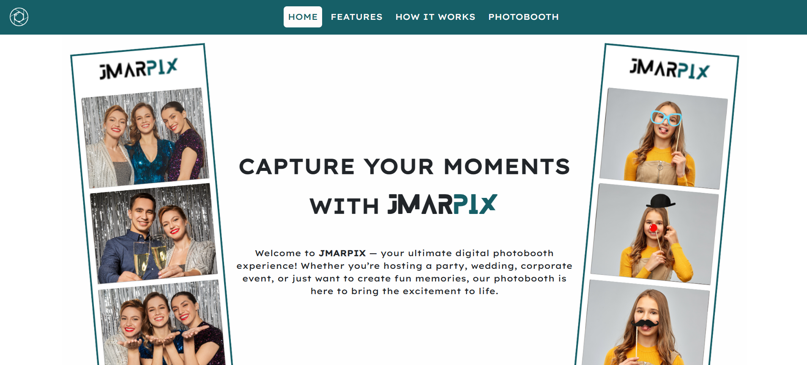

# JMARPIX – Digital Photobooth Web App

[](https://binibiningjenna.github.io/jmarpix/)


---

JMARPIX is a modern, responsive web-based photobooth designed to capture fun moments with real-time filters, countdown timers, and photo card downloads. Perfect for events like birthdays, weddings, and corporate parties!



---

## Features

### Core Functionalities

- **Live Camera Preview** – Access and display live webcam stream.
- **Photo Filters** – Apply real-time effects: Grayscale, Sepia, Contrast, and Brightness.
- **Countdown Timer** – Snap with customizable delays (0, 3, 10 sec).
- **Photo Card Builder** – Combine up to 3 snapshots into a downloadable image.
- **Instant Download** – Save your photo card with timestamp and logo.
- **Reshoot Option** – Clear and retake your shots easily.

### Sections

- `HOME` – Welcome and brand intro.
- `FEATURES` – Live filters, multi-shot photo cards, etc.
- `HOW IT WORKS` – Step-by-step guide with icons.
- `PHOTOBOOTH` – Embedded booth app (iframe).

---

## Tech Stack

| Technology         | Purpose                             |
| ------------------ | ----------------------------------- |
| `HTML5`            | Structure and layout                |
| `CSS3`             | Custom styles and responsive design |
| `Bootstrap 5.3`    | Layout framework and UI components  |
| `JavaScript (ES6)` | Interactivity and camera logic      |
| `Bootstrap Icons`  | UI icons                            |
| `AOS`              | Animate on Scroll library           |

---

## Project Structure

```
JMARPIX/
├── index.html # Landing Page
├── assets/
│ ├── img/ # Logos, covers
│ ├── styles.css # Custom styling
│ └── script.js # Webcam logic and photocard generator
└── booth.html # Embedded photobooth app
```

## How to Use Locally

### 1. Clone the Repository

````bash
git clone https://github.com/yourusername/jmarpix.git
cd jmarpix
````

### 2. Open in Browser
- Option 1: Double-click index.html
- Option 2: Use Live Server in your code editor
